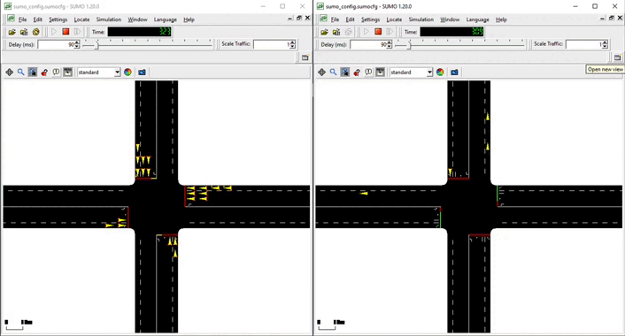
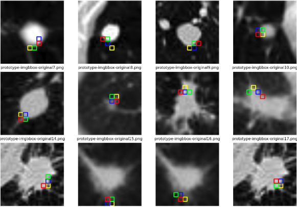
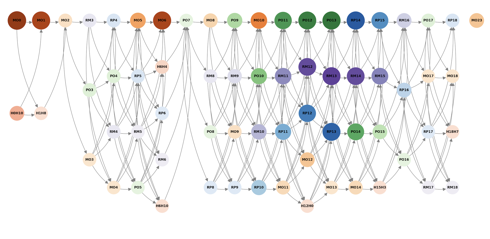

<h1 align="center">Duarte Moura</h1>

  Applied AI Engineer · Madrid 🇪🇸 
  Production LLM evaluation · Mechanistic interpretability · ML for medical imaging

  
  
  

---

### Now

🏗️ &nbsp; **Founding Applied AI Engineer @ [Galtea](https://galtea.ai)** — building evaluation, red-teaming, and conversation-simulation pipelines used by Tier-1 European banks. Forward-deployed across discovery, prompt engineering, and live production troubleshooting.

🔬 &nbsp; **ML Researcher @ [INESC TEC](https://www.inesctec.pt/)** — EU AI4Lungs project. First author of *Learning Visual Prototypes for Self-Explainable Lung Nodule Classification* — **IEEE EMBC 2026**.

☁️ &nbsp; *Previously:* Solutions Architect @ AWS — GenAI and ML deployments on SageMaker / Bedrock for public-sector and enterprise customers.

---

### Selected projects

<table>
  <tr>
    <td width="50%" valign="top">
      <h4>🩺 <a href="https://github.com/duartemoura/sMCI-vs-pMCI-Alzheimer">Alzheimer's Progression from PET</a></h4>
      MSc thesis (UC3M). Hierarchical 3D CNN predicting MCI-to-Alzheimer's conversion from FDG and tau-PET, with cross-modality transfer learning to bridge a ~3× data gap. Monte Carlo Dropout for uncertainty quantification and Grad-CAM for explainability — high-confidence predictions reach <b>~90% accuracy on FDG-PET</b>. Full thesis PDF in the repo.
        
      

        
      

    </td>
    <td width="50%" valign="top">
      <h4>🚦 <a href="https://github.com/duartemoura/reinvent-traffic-management">Traffic Optimisation with Deep RL</a></h4>
      Deep Q-Network agent trained in the SUMO simulator on Amazon SageMaker, ingesting simulated IoT signals through AWS analytics for real-time traffic-flow decisions. Selected to present at <b>AWS re:Invent</b> as an official workshop.
        
      

        
      

    </td>
  </tr>
  <tr>
    <td width="50%" valign="top">
      <h4>📄 EMBC 2026 — <i>Visual Prototypes for Self-Explainable Lung Nodule Classification</i></h4>
      First-author paper accepted at IEEE EMBC 2026, from work at INESC TEC on the EU AI4Lungs project. ViT with prototype-based interpretability for clinically auditable lung nodule predictions under regulatory constraints.
        
      

        
      

    </td>
    <td width="50%" valign="top">
      <h4>🧠 <a href="https://github.com/duartemoura/Refusal_MechanisticStudy">Mechanistic Study of Refusal in LLMs</a></h4>
      Component-level analysis of refusal in Qwen-1.8B using TransformerLens. Systematic ablation across residual streams, MLPs, and attention heads localised refusal to <b>a single attention head (L6_H10)</b> and three layers (6, 9, 11). Counterfactual injection of refusal activations into neutral prompts (e.g. <i>"how do I bake a cake?"</i>) reproduced refusals — evidence that the feature generalises beyond its intended context.
        
      

        
      

    </td>
  </tr>
</table>

---

### Stack

  
  
  
  
  
  
  
  
  

🇵🇹 Portuguese (native) · 🇬🇧 English · 🇪🇸 Spanish